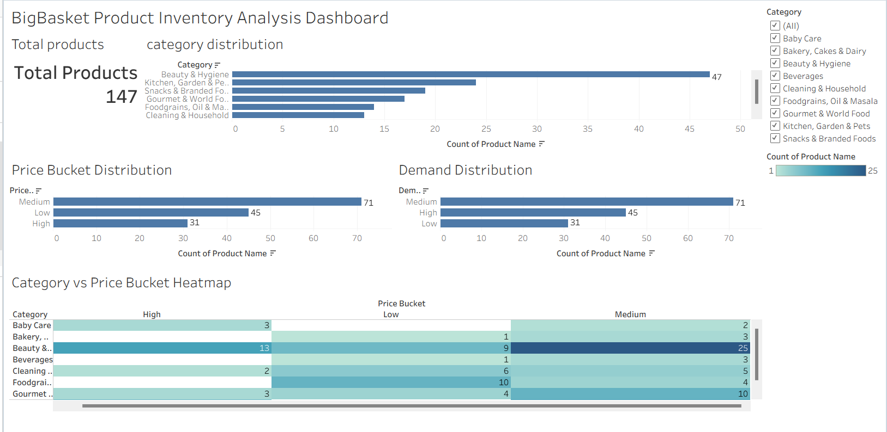

# BigBasket Inventory Analysis

End-to-end product inventory analysis using SQL, Python, and Tableau.

## Tech Stack
- SQL (MySQL): Data cleaning & feature engineering
- Python (Pandas, Seaborn, Matplotlib): Exploratory Data Analysis
- Tableau: Interactive dashboard & visual analytics

## Project Workflow
1. Cleaned raw product data in MySQL
2. Engineered price buckets and demand scores
3. Performed EDA in Python
4. Built an interactive Tableau dashboard

## Key Insights
- Medium-priced products dominate inventory
- Beauty & Hygiene has the highest product count
- Medium-demand products form the majority segment

## Dashboard Preview

